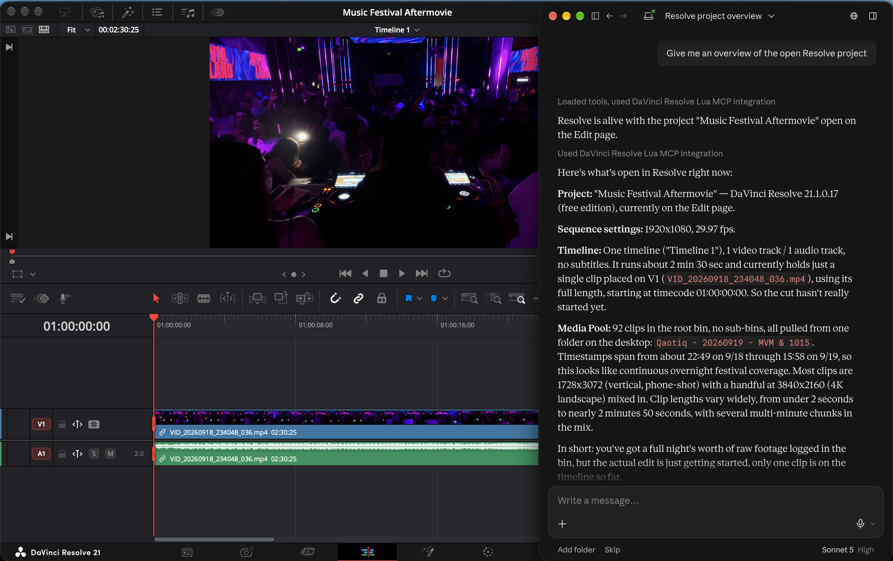
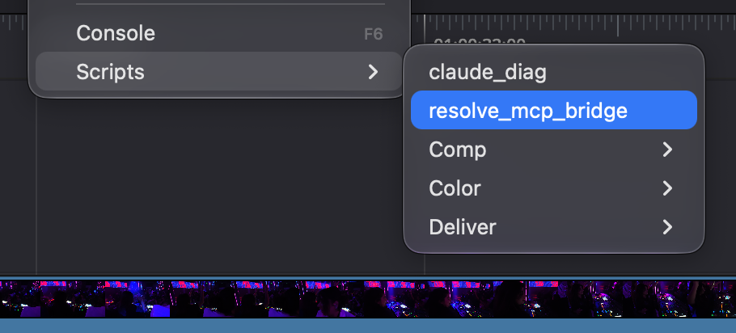
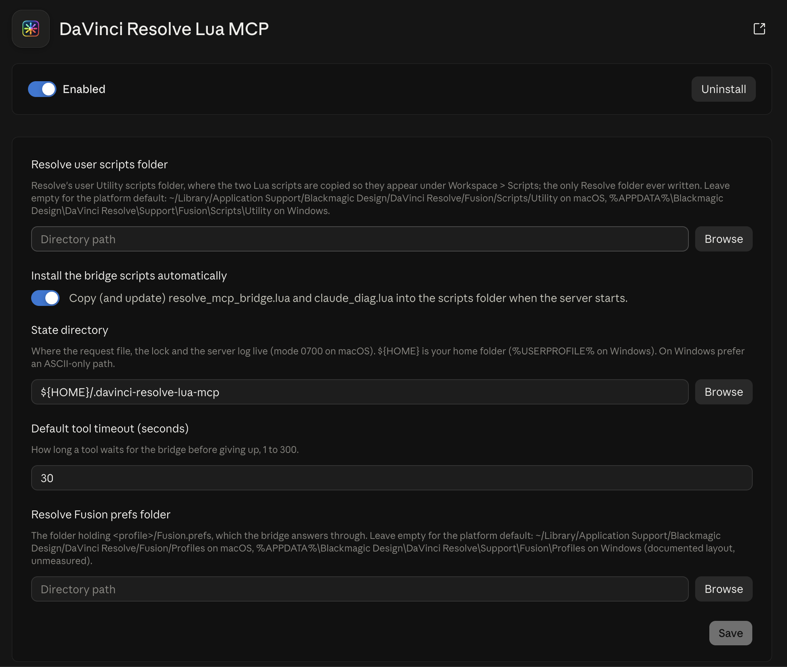

# DaVinci Resolve Lua MCP

*Control the free edition of DaVinci Resolve 21.1 from Claude through a Lua script that runs inside Resolve. macOS, no Studio licence, no network.*

[](https://github.com/saadk408/davinci-resolve-lua-mcp/actions/workflows/tests.yml) [](https://github.com/saadk408/davinci-resolve-lua-mcp/releases/latest) [](LICENSE)  



DaVinci Resolve 21.1 moved Python scripting and the external scripting API to the Studio edition, and Blackmagic's own MCP server ships with Studio only. One door is still open on the free edition: `Workspace > Scripts` lists and runs Lua files. This project puts a small Lua script there. Launched once per Resolve session, it holds the live `resolve` object and executes Lua on behalf of an MCP server that Claude Desktop runs as an extension. Requests travel as a file, answers come back through Fusion's preferences file, and nothing leaves the Mac.

> [!NOTE]
> Nothing here unlocks Studio features: the bridge uses the free edition's own Lua scripting API. Studio 21.1 users already have Blackmagic's native MCP server.

## Features

- **14 purpose-built tools**: project overview, project and timeline lists, Media Pool clips, timeline items, markers, timeline and project switching, rendering with status polling, and a search over Blackmagic's shipped scripting reference.
- **`run_lua` for everything else**: any Lua 5.1 chunk runs inside Resolve with the live `resolve` object and returns JSON, captured `print` output and errors.
- **One `.mcpb` bundle**: install it in Claude Desktop, and the server copies its two Lua scripts into Resolve's user scripts folder on first launch.
- **No network**: the server and the script talk through a request file and Fusion's preferences. There are no sockets, no listeners and no telemetry.
- **Fast enough to feel interactive**: about 60 ms per call, measured end to end on this Mac.

## Requirements

- macOS. Apple Silicon is the only hardware measured.
- DaVinci Resolve **21.1 free edition** (build 21.1.0.17 is the one measured). Studio is not needed and not targeted. Blackmagic documents neither this Lua host nor its sandbox, so a point release can change what works.
- Claude Desktop. It ships the Node runtime the server needs (Node 20 or newer); nothing else is installed.
- A project open in Resolve while you use the tools.

## Install

1. Download [`davinci-resolve-lua-mcp.mcpb`](https://github.com/saadk408/davinci-resolve-lua-mcp/releases/latest/download/davinci-resolve-lua-mcp.mcpb) (the latest release; the release notes and the SHA-256 are on the [Releases page](https://github.com/saadk408/davinci-resolve-lua-mcp/releases/latest)).
2. Double-click the file, or drag it onto the Claude Desktop window. Claude Desktop shows the extension's details and four settings; keep the defaults and click **Install**.
3. In Resolve, open a project and click `Workspace > Scripts > resolve_mcp_bridge`. The extension put that script there when it first started; Resolve's Console stays silent, which is expected.
   - The script stops when Resolve quits. Click it again after every Resolve launch, before using the tools.
4. Ask Claude "Are you connected to DaVinci Resolve?".

From a terminal instead, which downloads the file and opens the same install dialog:

```sh
curl -fsSLo ~/Downloads/davinci-resolve-lua-mcp.mcpb https://github.com/saadk408/davinci-resolve-lua-mcp/releases/latest/download/davinci-resolve-lua-mcp.mcpb && open ~/Downloads/davinci-resolve-lua-mcp.mcpb
```

To update, download again from the same link (or rerun the command) and open the file; extensions installed from a file do not update on their own. To build the bundle yourself, see [Development](#development).

## Start and stop the bridge

1. In Resolve, open a project.
2. Click `Workspace > Scripts > resolve_mcp_bridge`.
3. Nothing appears in Resolve's Console. That is expected: the free edition mutes `print` in menu scripts. The script is now looping in the background and Resolve stays responsive.
4. In Claude Desktop, ask for the bridge status or just start working. `resolve_status` reports `alive: true`, the product, version, edition, page and open project.

 Scripts menu listing claude_diag and resolve_mcp_bridge">

> [!IMPORTANT]
> The script lives and dies with Resolve. After every Resolve launch, click `Workspace > Scripts > resolve_mcp_bridge` again before using the tools. The bridge is never started automatically, by design: a loop started through `fusion:Execute` holds Fusion's shared script executor for the whole session, so the Scripts menu is the only supported launch.

To stop it, ask Claude to stop the bridge (`stop_bridge`), or quit Resolve. Clicking the script a second time while a loop is running is harmless: the new loop takes over and the old one exits on the first request addressed to the newer session.

## Example prompts

```text
Give me an overview of the open Resolve project.
List the clips in the root bin with their durations and frame rates.
What is on video track 1 of the current timeline?
Add a blue marker at frame 240 named "fix colour".
Delete all the red markers on this timeline.
Render the current timeline to ~/Movies/out as fix-v2 and tell me when it finishes.
Look up AppendToTimeline in the Resolve scripting docs.
Use run_lua to return the current timeline's start timecode and its item count on V1.
```

https://github.com/user-attachments/assets/febdf2b9-8e0d-4fbf-8462-0d6ecd98c829

## Tools

| Tool | What it does | Parameters | Access |
|---|---|---|---|
| `resolve_status` | Whether the bridge is running and why not, its session, the self-install outcome and, when alive, product, version, edition, page and project | none | read-only |
| `run_lua` | Runs a Lua 5.1 chunk inside Resolve with the live `resolve` object; returns its first return value as JSON plus captured prints and errors | `code`; `timeout_s` 1..300 (default from the settings) | destructive |
| `get_project_info` | Name, page, database, frame rate, resolution, timeline count, root-bin counts and the current timeline of the open project | none | read-only |
| `list_projects` | Projects in the current project-manager folder with dates and notes; marks the open one | none | read-only |
| `list_timelines` | Every timeline with unique id, frame range and track counts; marks the current one | none | read-only |
| `list_media_pool_clips` | Clips in one bin with path, duration, fps, resolution, type, frames and colour | `bin_path` (default `/`); `offset`; `limit` 1..200 (default 50) | read-only |
| `get_timeline_items` | Items on one track of the current timeline with type, frames, source frames, enabled state and file path | `track_type` video, audio or subtitle; `track_index` from 1; `offset`; `limit` 1..500 (default 100) | read-only |
| `add_marker` | Adds a marker to the current timeline and returns the stored marker | `frame` (relative to the timeline start); `color` (one of the 16 Resolve colours); `name`; `note`; `duration` in frames (default 1) | writes |
| `delete_markers` | Deletes every marker of one colour, or all markers, from the current timeline | `color` (omit for all); `confirm` must be `true` | destructive |
| `set_current_timeline` | Makes the named timeline current; an unknown name lists the known ones | `name` | writes |
| `open_project` | Loads the named project, saving the open one first by default; an unknown name lists the known projects | `name`; `save_current` (default `true`) | writes |
| `render_current_timeline` | Queues and starts a render of the current timeline and returns the job id | `preset` (optional, validated against the preset list); `output_dir` (absolute, must exist); `filename` | writes |
| `get_render_status` | Status, completion percentage and error of one render job, plus whether Resolve is rendering | `job_id` | read-only |
| `stop_bridge` | Asks the bridge loop to exit cleanly; relaunch it from `Workspace > Scripts` afterwards | none | writes |
| `scripting_api_docs` | Searches Blackmagic's shipped scripting reference (`.pyi` signatures, README sections, CHANGELOG) with file and line; flags deprecated and unsupported calls | `query`; `limit` 1..10 (default 5) | read-only |

Every tool declares its access hints to the client. `delete_markers` refuses without `confirm: true`, and Claude is told to ask you first; `run_lua` takes no confirmation and is flagged destructive so the client can warn. Results are JSON with a matching `structuredContent`; the paginated tools (`list_media_pool_clips`, `get_timeline_items`) report `total`, `offset`, `limit` and `truncated`, and every failure names the next step instead of throwing.

Marker colours: Blue, Cyan, Green, Yellow, Red, Pink, Purple, Fuchsia, Rose, Lavender, Sky, Mint, Lemon, Sand, Cocoa, Cream.

<details>
<summary>Writing Lua for <code>run_lua</code></summary>

The chunk runs inside Resolve's Scripts-menu Lua state (LuaJIT, Lua 5.1) with the globals `resolve` and `fusion`. Conventions, as the server also tells Claude:

- Call methods with a colon (`project:GetName()`) and read constants with a dot (`resolve.EXPORT_AAF`).
- API lists are 1-based tables: use `#list` and `for i = 1, #list`, never `pairs`. Dicts are keyed tables; `GetMarkers()` is keyed by frame number.
- Page names for `OpenPage` are lowercase (`"edit"`, `"color"`, `"deliver"`).
- `return` a value to get it back as JSON. Only the first return value is sent. `print` output is invisible in Resolve but comes back in `prints` (capped at 200 lines / 16 KB).
- Look the method up with `scripting_api_docs` first, and avoid the deprecated forms Blackmagic's shipped examples still use: `GetSetting`/`SetSetting` (use `GetSettings()`/`SetSettings({})`), `GetItemsInTrack` (use `GetItemListInTrack`), index-based render-job calls (ids are strings) and single-argument `GetClipProperty`.
- `io`, `os.execute`, `os.remove`, `require`, `package`, `ffi` and `debug` do not exist in this state; errors carry the message only, without a traceback.

```lua
local project = resolve:GetProjectManager():GetCurrentProject()
local timeline = project:GetCurrentTimeline()
local items = timeline:GetItemListInTrack("video", 1)
local out = {}
for i = 1, #items do
  out[i] = { name = items[i]:GetName(), first = items[i]:GetStart(), last = items[i]:GetEnd() }
end
return { timeline = timeline:GetName(), start_timecode = timeline:GetStartTimecode(), items = out }
```

</details>

> [!WARNING]
> The bridge handles one request at a time and cannot answer Resolve's modal dialogs. Long synchronous API calls (`RenderWithQuickExport`, `TranscribeAudio`, `Export`, `ArchiveProject`, `LoadProject` on an unsaved project when live save is off) block it until they finish. Start renders with `render_current_timeline` and poll `get_render_status` instead of waiting inside `run_lua`.

## Settings

Claude Desktop shows these four settings when you install the extension. The defaults work for a standard Resolve installation.



| Setting | Default | What it does |
|---|---|---|
| Resolve user scripts folder | `~/Library/Application Support/Blackmagic Design/DaVinci Resolve/Fusion/Scripts/Utility` | Where the two Lua scripts are copied so they appear under `Workspace > Scripts`. Only this folder is ever written, and it is never created: launch Resolve once so it exists. |
| Install the bridge scripts automatically | on | Copy (and update) `resolve_mcp_bridge.lua` and `claude_diag.lua` into the scripts folder when the server starts. Off means you copy them by hand. |
| State directory | `~/.davinci-resolve-lua-mcp` | Where the request file, the lock and the server log live. Created with mode 0700. |
| Default tool timeout (seconds) | 30 | How long a tool waits for the bridge before giving up, 1 to 300. `run_lua` can override it per call. |

<details>
<summary>Environment variables (for the developer loop and tests)</summary>

The settings map onto the first four variables; the rest have no setting. A bad value falls back to its default and shows up in `resolve_status` under `config_problems`; the server never refuses to start over configuration.

| Variable | Default | Meaning |
|---|---|---|
| `RLB_SCRIPTS_DIR` | the user scripts folder above | The only Resolve path written. |
| `RLB_AUTO_INSTALL` | `true` | Self-install the two Lua files on start. |
| `RLB_STATE_DIR` | `~/.davinci-resolve-lua-mcp` | Holds `next.lua`, `next.lua.tmp`, `lock` and `server.log`. `~` and `${HOME}` are expanded. |
| `RLB_DEFAULT_TIMEOUT_S` | `30` | 1..300 seconds. |
| `RLB_MAX_RESPONSE_KB` | `64` | Cap on a response's JSON, 1..192 KB. |
| `RLB_LOG_LEVEL` | `info` | `debug`, `info`, `warn` or `error`. |
| `RLB_PREFS_DIR` | `~/Library/Application Support/Blackmagic Design/DaVinci Resolve/Fusion/Profiles` | Folder of `<profile>/Fusion.prefs` files; the newest one is read. |
| `RLB_DOCS_DIR` | `/Library/Application Support/Blackmagic Design/DaVinci Resolve/Developer/Scripting` | Blackmagic's shipped reference, read by `scripting_api_docs`. Never written. |

</details>

## Troubleshooting

- **The script is missing from `Workspace > Scripts`.** Ask Claude for `resolve_status` and read `bridge_script.outcome`: `installed`, `updated` or `up_to_date` mean the file is in the scripts folder, so reopen the menu (Resolve lists a new file without a restart); `skipped_auto_install_off` means the setting is off, copy `bridge/resolve_mcp_bridge.lua` and `scripts/claude_diag.lua` there yourself; `scripts_dir_missing` means the folder does not exist, launch Resolve once so it creates it, or fix the scripts-folder setting (the server never creates Resolve folders); `permission_denied` and `error` carry the operating-system message. A state directory path that cannot be stamped into the script (it contains `]==]`, a double quote, a backslash or a newline, or starts with `@@`) turns auto-install off and is named in `config_problems`; `state_dir_unstampable` is the same problem when the copy step reports it itself. The same outcome is in the server log named below.
- **Nothing appears in the Console when I click the script.** Expected. `print` is muted in menu scripts on free 21.1. Check `resolve_status` instead.
- **I copied the script into `Scripts/Deliver`.** Resolve also offers that folder's scripts as selectable render start/end scripts in the Deliver page, which is not where the bridge belongs. Delete the copy and keep the script in `Scripts/Utility` only.
- **`Fusion.prefs` is not updating.** The bridge writes preferences only when it answers a request, so first check that the loop is running (`resolve_status`). The newest `Fusion.prefs` under the Profiles folder is the one read, whatever the profile is called; set `RLB_PREFS_DIR` only if that folder is somewhere else. A save that fails while Resolve is writing the file is attempted up to five times, and a failed start save is retried once a second until it lands.
- **`resolve_status` says `prefs_missing`.** No `Fusion.prefs` exists under the profiles folder. Launch Resolve at least once on this Mac, or point `RLB_PREFS_DIR` at its `Fusion/Profiles` folder.
- **A request is stuck, or a tool times out.** The bridge is busy on a long synchronous call or a modal dialog it cannot answer: wait for Resolve to finish, then retry. Requests older than 120 s are refused by the bridge and the server removes `next.lua` after a timeout, so nothing needs clearing by hand. For slow calls, raise the default timeout (up to 300 s) or pass `timeout_s` to `run_lua`.
- **`resolve_status` says `lock_held`.** Another server kept the request slot for longer than the timeout: a second Claude Desktop entry, `make smoke`, or a dev-register loop. Stop it, or point `RLB_STATE_DIR` elsewhere. Remove `~/.davinci-resolve-lua-mcp/lock` by hand only if the pid it names is not a server.
- **Resolve was restarted mid-session.** `resolve_status` says `resolve_gone` (the recorded pid is dead) or `no_reply`. The session record survives the restart on purpose, and there is no heartbeat, so nothing restarts the loop for you: click `Workspace > Scripts > resolve_mcp_bridge` again.
- **I double-clicked the script.** Harmless. The newer loop takes over; the older one exits on the first request it sees for the newer session and never touches preferences again.
- **The response says `truncated: true`.** The JSON exceeded the cap (64 KB by default). For `run_lua`, `result_preview` holds the start of it; a purpose-built tool over the cap answers with an error that names the cap and asks for a smaller `limit` or a different `offset`. Use `offset` and `limit` on the list tools, return less from your Lua, or raise `RLB_MAX_RESPONSE_KB` (192 KB at most).
- **Reinstalling shows no dialog.** Remove the extension under Settings > Extensions, then open the `.mcpb` again; Claude Desktop relaunches the server at once.
- **A tool answers `bad_response`.** The installed script and the server disagree on the protocol, usually after an upgrade of one but not the other. Restart Claude Desktop so the server reinstalls the script, then relaunch it from the Scripts menu.
- **Where the logs are.** Claude Desktop keeps the server's stderr in `~/Library/Logs/Claude/mcp-server-DaVinci Resolve Lua MCP.log`, which records the connection, not the chat's tool calls; the server's own log is `~/.davinci-resolve-lua-mcp/server.log` (truncated at 5 MB; the path is also in `resolve_status`); the installed extension lives under `~/Library/Application Support/Claude/Claude Extensions/local.mcpb.saad-khan.davinci-resolve-lua-mcp/`. The proof that a call ran is the last answer in `Fusion.prefs`:

  ```sh
  PREFS=~/Library/Application\ Support/Blackmagic\ Design/DaVinci\ Resolve/Fusion/Profiles/Default/Fusion.prefs
  grep -o 'RLBResp = "[^"]*"' "$PREFS" | cut -d: -f2 | tr -d '"' | xxd -r -p
  ```

## Security

> [!WARNING]
> Anything that can write one file on this Mac can run Lua inside Resolve with your privileges. Read a `run_lua` chunk before you approve it.

- The state directory is created with mode 0700, and the request slot is a single file in it. Any local process that can write `~/.davinci-resolve-lua-mcp/next.lua` while the bridge is running runs Lua inside Resolve as you; the state directory's permissions are the whole boundary.
- The last response persists hex-encoded in `Fusion.prefs` until the next one overwrites it. On the measured Mac that file has mode 0666, so any local account can read the previous answer. A clean stop marks the session record `stopped` and replaces the last answer with the stop acknowledgement.
- The extension runs with your user's privileges, inside Claude Desktop's process model, with no sandbox of its own. It writes only its state directory and the two Lua files in Resolve's user scripts folder.
- `run_lua` executes whatever Lua Claude writes. `delete_markers` asks for `confirm`; `run_lua` takes no confirmation, is the general escape hatch, and is marked destructive for that reason.
- No network: the server opens no sockets and makes no requests. Files in, preferences out.

## Privacy Policy

The extension runs entirely on your Mac and sends nothing anywhere. The full policy is [PRIVACY.md](https://github.com/saadk408/davinci-resolve-lua-mcp/blob/main/PRIVACY.md); in short:

- **Collection.** It processes what Claude sends it (Lua code, marker text, names, paths) and what Resolve answers (project, timeline, clip and marker metadata, media paths). No accounts, no credentials, no telemetry, analytics or crash reporting.
- **Use and storage.** That data lives only in the request file (one call, then deleted), the last answer in `Fusion.prefs`, the server log (ids, timings, paths and error messages; never Lua code, arguments or results) and Claude Desktop's copy of that log.
- **Third-party sharing.** None by the extension. Claude Desktop sends tool inputs and results to Anthropic as part of your conversation, under Anthropic's privacy policy; GitHub serves the download.
- **Retention.** Until the next call or bridge launch overwrites the answer, until the log passes 5 MB, and otherwise until you delete the files as described under [Uninstall](#uninstall).
- **Contact.** Questions: [open an issue](https://github.com/saadk408/davinci-resolve-lua-mcp/issues). Security problems: the repository's Security tab, as [SECURITY.md](https://github.com/saadk408/davinci-resolve-lua-mcp/blob/main/SECURITY.md) describes.

## Uninstall

1. Remove "DaVinci Resolve Lua MCP" under Settings > Extensions in Claude Desktop.
2. Delete `resolve_mcp_bridge.lua` and `claude_diag.lua` from `~/Library/Application Support/Blackmagic Design/DaVinci Resolve/Fusion/Scripts/Utility/` (from a checkout, `make uninstall-bridge` removes exactly those two files).
3. Delete `~/.davinci-resolve-lua-mcp`.

The `Global.ResolveLuaBridge.*` keys stay in `Fusion.prefs` (under 2 KB after a clean stop: the session record, the stop answer and eight blanked keys). Remove them from Fusion's preferences if you want the file pristine.

## Development

Prerequisites: Node 20 or newer (the Makefile sources `~/.nvm/nvm.sh`), npm, a DaVinci Resolve installation (the Lua tests run under its bundled `fuscript` interpreter at `/Applications/DaVinci Resolve/DaVinci Resolve.app/Contents/Libraries/Fusion/fuscript`), and optionally `lua-language-server` for `make lint-lua`.

```sh
git clone https://github.com/saadk408/davinci-resolve-lua-mcp.git
cd davinci-resolve-lua-mcp
npm install
make test      # Lua checks under fuscript + the Node suite
make bundle    # dist/davinci-resolve-lua-mcp.mcpb, validated and probed
make install   # make bundle, then open the .mcpb so Claude Desktop shows its dialog
```

| Target | What it does |
|---|---|
| `make test` | Grep gates, then the Lua checks under `fuscript` and the Node tests (`node --test` through `tsx`). Every fixture is a temp dir; nothing under `~/Library` is touched. |
| `make build` | `tsc --noEmit`, then esbuild `src/index.ts` into `server/index.js` (CommonJS, Node 20 target). |
| `make bundle` | Build, `mcpb validate`, `mcpb pack` into `dist/`, `mcpb info`, then the bundle gate: exact file list, size under 2 MB, and a stdio `tools/list` probe of the unpacked copy under a temp state dir. |
| `make install` | Bundle, then `open` the `.mcpb`. The install click is yours. |
| `make sign` | Optional self-signed `mcpb sign` plus `mcpb verify`; `cert.pem` and `key.pem` stay out of git and the bundle. |
| `make dev-register` / `make dev-unregister` | Add or remove a `davinci-resolve-lua-mcp-dev` entry in `~/Library/Application Support/Claude/claude_desktop_config.json` that runs `server/index.js` from this checkout with the current Node. The file is backed up first, other keys are kept, mode 0600 is preserved. `scripts/dev-register.mjs` takes `--config`, `--name`, `--env` (a `KEY=VALUE` file whose `RLB_*` lines become the entry's environment; default `.env`), `--dry-run` and `--remove`. |
| `make smoke SMOKE_PROJECT="<name>"` | Build, then drive the real tools against the live bridge exactly as Claude Desktop does: status, latency, prints and errors, project and timeline listings, a scratch timeline with markers, pagination, truncation, a render and its cleanup. `SMOKE_FLAGS=--no-render` skips the render. Output goes to `.out/smoke.log`. |
| `make stop` | Ask the running bridge loop to exit (`stop_bridge`); relaunch it from the Scripts menu afterwards. |
| `make uninstall-bridge` | Remove exactly `resolve_mcp_bridge.lua` and `claude_diag.lua` from the scripts folder (`RLB_SCRIPTS_DIR` overrides the default). |
| `make lint-lua` | Check that the generated API types match the installed `.pyi`, then run `lua-language-server --check` over the workspace, failing on any diagnostic under `bridge/` or `tests/`. |
| `make inspect` | Build, then `tools/list` through the MCP Inspector CLI. The Inspector runs the server with the production paths, so this performs the real self-install. |
| `make gen-types`, `make clean` | Regenerate `types/resolve_host.d.lua` from the shipped `.pyi`; remove `server/`, `dist/` and `.out/`. |

The developer loop: `make dev-register` once, then `make build` and restart Claude Desktop after each change, with no repack. The dev entry and the installed extension can run side by side: the request-slot lock is taken per request and released at once, so an idle server never blocks the other.

Releases: pushing a `vX.Y.Z` tag runs `.github/workflows/release.yml`, which runs the Node gates and `make bundle` on the tagged commit, then publishes a GitHub Release with the bundle attached and its SHA-256 in the notes; an annotated tag's message becomes the notes' introduction. A second job publishes the release to the [MCP Registry](https://registry.modelcontextprotocol.io) as `io.github.saadk408/davinci-resolve-lua-mcp`, with the hash of the file the release serves.

> [!NOTE]
> `make smoke` creates and deletes a timeline named `bridge-smoke`, adds and deletes markers on it, and sets the project's render target directory and file name. `SMOKE_PROJECT` must be the name of the project that is open in Resolve, and it should be a scratch project, never a real edit. The run refuses to proceed when the names differ.

Layout: `bridge/resolve_mcp_bridge.lua` is the in-Resolve loop (one dependency-free file, under 600 lines); `src/` is the TypeScript server (`server.ts` holds the 15 tools, `lua.ts` every Lua snippet and the one string-escaping helper, `protocol.ts` the request slot and lock, `prefs.ts` the `Fusion.prefs` reader, `bridgeInstall.ts` the self-install); `scripts/claude_diag.lua` is the sandbox diagnostic that also ships in the bundle; `tests/` holds the Node suite and `tests/lua/` the `fuscript` checks; `docs/images/` holds the README's screenshots.

## Acknowledgments

This project builds on the work of:

- [AutoSubs](https://github.com/tmoroney/auto-subs) - Lua bridge over Fusion preferences on free 21.1, the channel this project adopted
- [samuelgursky/davinci-resolve-mcp](https://github.com/samuelgursky/davinci-resolve-mcp) - MCP server for DaVinci Resolve Studio through the Python scripting API

DaVinci Resolve is a trademark of Blackmagic Design Pty Ltd. This project is not affiliated with or endorsed by Blackmagic Design.
